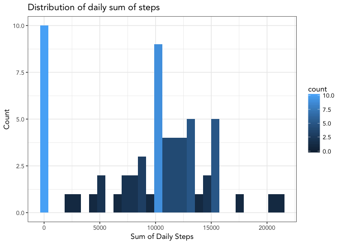
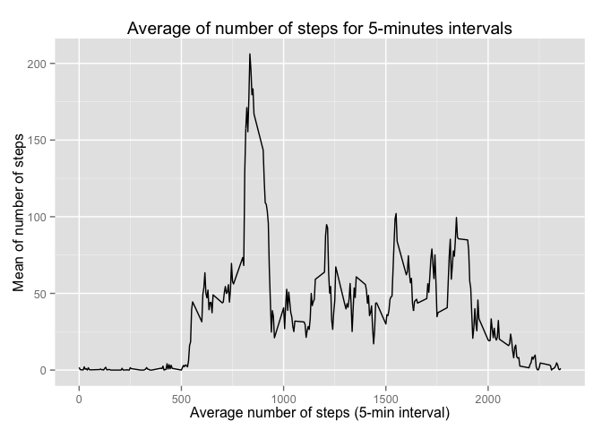
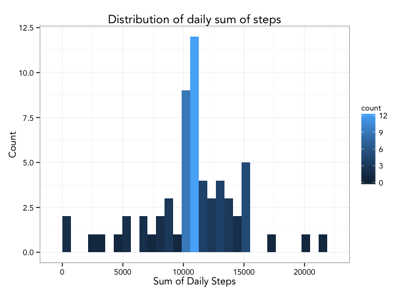
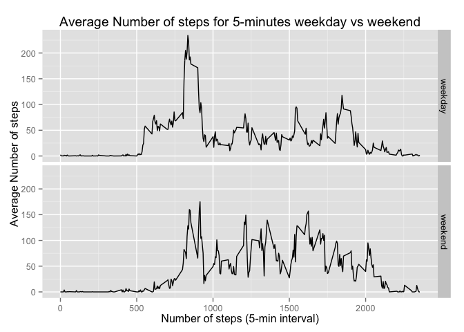

# Reproducible Research: Peer Assessment 1

In this brief empirical analysis data from a personal activity monitoring device is analyzed in order to:

- find **daily mean** of the total number of steps

- find possible **patterns** in average daily activity

- find an adequate **proxy** for NA values, and subsequently use them to compute simple **summary statistics** (mean and median)

- evaluate **differences in activity patterns** between weekdays and weedend days 

Throughout the whole analysis there will be evidences of the whole R code actually used to perform the computations, to find the desired results and to create the required graphics

## Loading and preprocessing the data
Assuming the dataset *activity.csv* is in the current working directory of R (recall: use getwd() to verify the actual working directory, use setwd() to set a new working directory) these are the steps required to load the data into R:

```r
data <- read.csv("activity.csv", header = TRUE, sep = ",")
```
The data.frame just loaded is made of  17568 observations of 3 variables, with the following structure:

- **steps**,  loaded as interger values

- **date**, loaded as factors with 61 levels

- **interval**, loaded as integer values

It may be useful to create an additional variable, summarizing the two variables *date* and *interval* into a single object of POSIXct class, as follows:

```r
library(dplyr)
```

```
## 
## Attaching package: 'dplyr'
```

```
## The following objects are masked from 'package:stats':
## 
##     filter, lag
```

```
## The following objects are masked from 'package:base':
## 
##     intersect, setdiff, setequal, union
```

```r
library(lubridate)
```

```
## 
## Attaching package: 'lubridate'
```

```
## The following object is masked from 'package:base':
## 
##     date
```

```r
data <- mutate(.data = data, time = ymd_hm(paste(date, sprintf(fmt = "%04d", interval),sep = " ")))
```

## What is mean total number of steps taken per day?
To compute the total number of steps taken per day, from the original dataset, using *dplyr*, data is grouped by date variable, then summarized applying the function sum(), excluding NA values. The following is the R code used to perform those steps:

```r
library(dplyr)
tot_steps <- data %>%
        group_by(date) %>%
        summarize(tot_steps = sum(steps, na.rm = TRUE))
```
The following graph shows the distribution of the daily total number of steps, computed with the previous code 

```r
library(ggplot2)
g <- ggplot()
g <- g + geom_histogram(data = tot_steps, aes(tot_steps, fill= ..count..))
g <- g + theme_bw(base_family="Avenir")
g <- g + labs(x = "Sum of Daily Steps", y = "Count")
g <- g + labs(title = "Distribution of daily sum of steps")
print(g)
```

```
## `stat_bin()` using `bins = 30`. Pick better value with `binwidth`.
```

<!-- -->
The maximum value of the distribution resides in the lower class, with 10 occurrences.

Using the data on daily total number of steps, from the previous graph, the mean and median values for the observed sample are as follows:


```r
mean(tot_steps$tot_steps)
```

```
## [1] 9354.23
```

```r
median(tot_steps$tot_steps)
```

```
## [1] 10395
```

## What is the average daily activity pattern?
In order to graps the average daily activity pattern, a line plot of average number of steps taken in a 5-minutes interval may be useful.
The following R code compute the average number of steps taken for each interval and assing this new variable to a new object, called *av_int_steps* and plot the desired line graph.

```r
library(dplyr)
library(ggplot2)
av_int_steps <- data %>%
        group_by(interval) %>%
        summarize(mean = mean(steps, na.rm = TRUE))
g <- ggplot()
g <- g + geom_line(data = av_int_steps, aes(x = interval, y = mean))
g <- g + labs(x = "Average number of steps (5-min interval)", y = "Mean of number of steps")
g <- g + labs(title = "Average of number of steps for 5-minutes intervals")
print(g)
```

<!-- -->

The main evidence, as shown in the graph, is that the maximum average number of steps in a 5 minute span is reached between the 7:30 am and 10:00 am (extacly at 8:35 am). This peak doubles the value of the other relevant high average 5-minute span, in the rest of the day
## Imputing missing values
The results obtained in the previous sections of this analysis are useful to obtain a first intuition regarding possible activity patterns. However, as immediately clear when inspecting the whole dataset, the presence of missing values my affect the previous result (recall that in the previous computations the missing values were omitted). By inspecting the dataset to evaluate the number of missing values, this is the result obtained:

```r
sum(is.na(data$steps))
```

```
## [1] 2304
```
2304 values(roughly the 13% of the values) are missing values.

There is no exact way of dealing with missing values, therefore, a certain degree of discretion, that may lead to minor discrepancies in the results, is permitted.
For our purpose, the missing values will be replaced with the average value of that 5-minute span, as computed in the previous section. This choice should lead to differences in the total daily sum of number of steps but no differences in the average for the 5-minute span.

The following R code define the new variable adj_steps

```r
i <- 0
adj_steps <- numeric(length = length(data$steps))
for(i in 1:length(data$steps)){
        if(is.na(data$steps[i])){
                adj_steps[i] <- av_int_steps$mean[which(av_int_steps$interval == data$interval[i])]
        }
        else adj_steps[i] <- data$steps[i]
}
```

With this variable a new data.frame can be defined and used to replicate the first analisis on the daily total number of steps.

```r
library(dplyr)
data_adj <- data
data_adj$steps <- adj_steps
tot_steps_adj <- data_adj %>%
        group_by(date) %>%
        summarize(tot_steps = sum(steps, na.rm = TRUE))
```
The following graph shows the distribution of the daily total number of steps, the mean and the median values.

```r
library(ggplot2)
g <- ggplot()
g <- g + geom_histogram(data = tot_steps_adj, aes(tot_steps, fill= ..count..))
g <- g + theme_bw(base_family="Avenir")
g <- g + labs(x = "Sum of Daily Steps", y = "Count")
g <- g + labs(title = "Distribution of daily sum of steps")
print(g)
```

```
## `stat_bin()` using `bins = 30`. Pick better value with `binwidth`.
```

<!-- -->

```r
mean(tot_steps_adj$tot_steps)
```

```
## [1] 10766.19
```

```r
median(tot_steps_adj$tot_steps)
```

```
## [1] 10766.19
```
It is immediately clear that the distribution of daily total number of steps changed drastically from the one computed without the missing values. In fact, the lower class, that in the first analysis was the one with the highest number of occurrances, now has lost its value in favour of the other high value classes. This is a far more consistent result than the one obtained with the first analysis. Furthermore, both the values of the mean and the median have increased.
## Are there differences in activity patterns between weekdays and weekends?
As last step of this analysis, activity patterns grouped for weekdays and weekends must be inspected in order to evaluate possible differencies. One could expect that, even if not from the point of view of the total number of steps, from the point of view a the 5-minute interval series some differencies may be found.

In order to compare the two different series in the same graph, a variable representing the *type* of the day (if a week day or a weekend day) must defined and then the average across the 5 minute interval must computed for each group, as in the previous analysis.

```r
library(dplyr)
library(ggplot2)
i <- 0
days <- vector(mode = "character", length(data$date))
for (i in 1:length(data$date)){
        if(weekdays(data$time[i])=="Saturday"|weekdays(data$time[i])=="Sunday"){
                days[i] <- "weekend"
        }
        else days[i] <- "weekday"
}
data <- mutate(data, day_type = days)
av_int_steps_bt <- data %>%
        group_by(interval, day_type) %>%
        summarize(mean = mean(steps, na.rm = TRUE))

g <- ggplot()
g <- g + geom_line(data = av_int_steps_bt, aes(x = interval, y = mean))
g <- g + facet_grid(day_type ~ .)
g <- g + labs(x = "Number of steps (5-min interval)", y = "Average Number of steps")
g <- g + labs(title = "Average Number of steps for 5-minutes weekday vs weekend")
print(g)
```

<!-- -->

The two plots comparing the Average number of steps in a 5-minute interval for weekdays and weekend days seems to be slightly different. In the first plot (weekdays) the general maximum is clearly defined, similarly to the graph of the previous analysis. On the other hand, the graph for the weekdays shows 4 peaks where the average number of steps is similar.

This leads, therefore, to the conclusion that there is a slightly different activity between the weekday (where a clear maximum can be identified and has an average which double the second highest peak) and the weekend days, where the activity is somewhat cyclical between 5 am and 8 pm.
