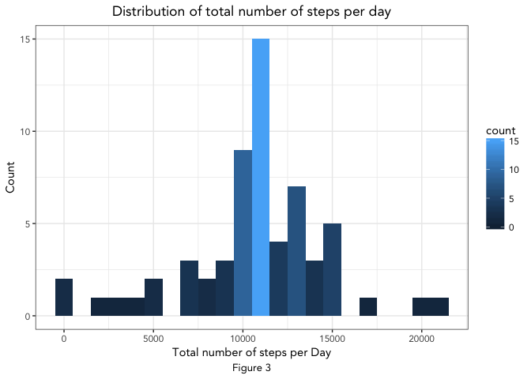
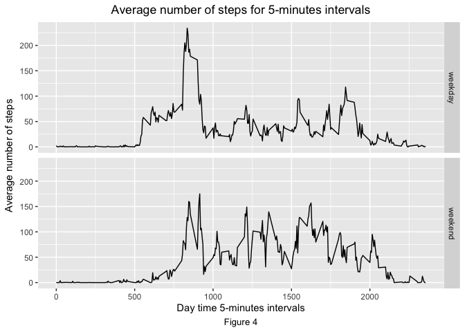

# Reproducible Research: Peer Assessment 1

This paper shows the results of the analysis performed on data retrieved from a personal activity monitoring device. The outcome of this analysis are as follows:

- Calculation of **daily mean** of the total number of steps;

- Evaluation of **patterns** in average daily activity;

- Definition of a **proxy value** for NA values to be used;

- Calculation of **summary statistics** (mean and median) with adjusted dataset;

- Evaluation of **differences ** in activity patterns for week vs. weedend days. 

The analysis was performed with:

- R v3.4 -- "You Stupid Darkness";

- RStudio v1.0.

To replicate the analysis the following R packages are required:


```r
library(dplyr)
library(lubridate)
library(ggplot2)
```
For each step of the analysis there will be a reference to the specific libraries required to run that code.

The complete R code, developed for this analysis, is presented throughout the document. 


## Loading and preprocessing the data
Assuming the dataset *activity.csv* is in the current working directory of R (recall: use getwd() to verify the actual working directory, use setwd() to set a new working directory), this is the process to load that specific dataset into R:

```r
data <- read.csv("activity.csv", header = TRUE, sep = ",")
```
The data.frame just loaded is made of  17568 observations of 3 variables, with the following structure:

- **steps**,  loaded as interger values;

- **date**, loaded as factors with 61 levels;

- **interval**, loaded as integer values.

For the following calculations, it may be useful to create an additional variable as the sum of the two variables *date* and *interval* to define a single object of POSIXct class, as follows:


```r
library(dplyr)
library(lubridate)
data <- mutate(.data = data, time = ymd_hm(paste(date, sprintf(fmt = "%04d", interval),sep = " ")))
```

## What is mean total number of steps taken per day?
From the original dataset, to compute the mean total number of steps, the process is as follows:

- group the dataset by *date* variable, with group_by function; 

- sum the variable *steps* excluding NA values, with summarize function.

The result will be a summarized dataset where the relation between day and total number of steps taken is explicit.

The following is the R code used to perform those steps:

```r
library(dplyr)
tot_steps <- data %>%
        group_by(date) %>%
        summarize(tot_steps = sum(steps, na.rm = TRUE))
```
The following graph (Figure 1) shows the distribution of the daily total number of steps, computed with the previous code.

```r
library(ggplot2)
g <- ggplot()
g <- g + geom_histogram(data = tot_steps, aes(tot_steps, fill= ..count..), binwidth = 1000)
g <- g + theme_bw(base_family="Avenir")
g <- g + labs(x = "Total number of steps per Day", y = "Count")
g <- g + labs(title = "Distribution of total number of steps per day")
g <- g + labs(caption = "Figure 1")
g <- g + theme(plot.title = element_text(hjust = 0.5), plot.caption = element_text(hjust = 0.5))
print(g)
```

<!-- -->

The maximum value of the distribution resides in the lower class, with 10 occurrences.

Using computed values on total number of steps per day, as shown in Figure 1, the mean and median values for the observed sample are as follows:


```r
mean(tot_steps$tot_steps)
```

```
## [1] 9354.23
```

```r
median(tot_steps$tot_steps)
```

```
## [1] 10395
```

## What is the average daily activity pattern?
In order to graps the average daily activity pattern, a line plot of average number of steps taken in a 5-minutes interval may be useful.
The following R code compute the average number of steps taken for each interval and assing this new variable to a new object, called *av_int_steps* and plot the desired line graph.

```r
library(dplyr)
library(ggplot2)
av_int_steps <- data %>%
        group_by(interval) %>%
        summarize(mean = mean(steps, na.rm = TRUE))
```

```r
g <- ggplot()
g <- g + geom_line(data = av_int_steps, aes(x = interval, y = mean))
g <- g + labs(x = "Day time 5-minutes intervals", y = "Average number of steps")
g <- g + labs(title = "Average number of steps for 5-minutes intervals")
g <- g + labs(caption = "Figure 2")
g <- g + theme(plot.title = element_text(hjust = 0.5), plot.caption = element_text(hjust = 0.5))
print(g)
```

<!-- -->

The main evidence, as shown in Figure 2, is that the maximum average number of steps in a 5 minute span is reached between the 7:30 am and 10:00 am (extacly at 8:35 am). This peak doubles the value of the second high average time span.
## Imputing missing values
The results obtained in the previous sections of the analysis are useful to obtain a first intuition regarding possible activity patterns. However, as immediately clear when inspecting the whole dataset, the presence of missing values highly affects the previous results (recall that in the previous computations the missing values were omitted).
By inspecting the dataset to evaluate the number of missing values, this is the result obtained:

```r
sum(is.na(data$steps))
```

```
## [1] 2304
```
Therefore approximately the 13% of the observations display missing values.

There is no unique way of dealing with missing values, in facts, many solutions can be performed by discretion. Choosing a proxy rather than another may lead to minor discrepancies in the results without affecting the quality of the overall results.
For our purpose, the missing values will be replaced with the average value of that 5-minute span, as computed in the previous section. This choice should lead to differences in the total daily sum of number of steps but no differences in the average for the 5-minute span, therefore, should not have a negative impact on final analysis.

The following R code define the new variable *adj_steps*, as follows:

```r
i <- 0
adj_steps <- numeric(length = length(data$steps))
for(i in 1:length(data$steps)){
        if(is.na(data$steps[i])){
                adj_steps[i] <- av_int_steps$mean[which(av_int_steps$interval == data$interval[i])]
        }
        else adj_steps[i] <- data$steps[i]
}
```

With this variable a new data.frame without missing values can be defined and used to replicate the first analisis performed on the distribution of total number of steps.

```r
library(dplyr)
data_adj <- data
data_adj$steps <- adj_steps
tot_steps_adj <- data_adj %>%
        group_by(date) %>%
        summarize(tot_steps = sum(steps, na.rm = TRUE))
```
The following graph shows the distribution of the daily total number of steps, the mean and the median values.

```r
library(ggplot2)
g <- ggplot()
g <- g + geom_histogram(data = tot_steps_adj, aes(tot_steps, fill= ..count..), binwidth = 1000)
g <- g + theme_bw(base_family="Avenir")
g <- g + labs(x = "Total number of steps per Day", y = "Count")
g <- g + labs(title = "Distribution of total number of steps per day")
g <- g + labs(caption = "Figure 3")
g <- g + theme(plot.title = element_text(hjust = 0.5), plot.caption = element_text(hjust = 0.5))
print(g)
```

<!-- -->

The simple descriptive statistics of the adjusted dataset are as follows:

```r
mean(tot_steps_adj$tot_steps)
```

```
## [1] 10766.19
```

```r
median(tot_steps_adj$tot_steps)
```

```
## [1] 10766.19
```
It is immediately clear that the distribution of daily total number of steps changed drastically from the one computed without the missing values. In fact, as shown in Figure 3, the lower class, the one with the highest number of occurrencies in the first analysis, has now lost its relevance in favour of other classes. From the point of view of the shape of this new distribution, the result is far more consistent than the previous one because the higher frequency classes are centered around the mean and median values, with a consistent reduction in the left tail. Furthermore, as expected, both values of mean and median have increased.
## Are there differences in activity patterns between weekdays and weekends?
As last step of this analysis, activity patterns grouped for weekdays and weekends must be inspected in order to evaluate possible differencies and indentify pattern. As an hypotesis, one could expect that, even if  the total number of steps per day may slightly change form weekday to weekend day, considering the average number of steps in a 5 minute interval should displays some differences, if not only for the fact that usually during weekends the wake up time is delayed.

In order to compare the two different series in the same graph, a variable representing the *type* of the day ( weekday or weekend day) is defined and then used to computed the average across the 5 minute interval each group.

```r
library(dplyr)
library(ggplot2)
i <- 0
days <- vector(mode = "character", length(data$date))
for (i in 1:length(data$date)){
        if(weekdays(data$time[i])=="Saturday"|weekdays(data$time[i])=="Sunday"){
                days[i] <- "weekend"
        }
        else days[i] <- "weekday"
}
data <- mutate(data, day_type = days)
av_int_steps_bt <- data %>%
        group_by(interval, day_type) %>%
        summarize(mean = mean(steps, na.rm = TRUE))
```

```r
g <- ggplot()
g <- g + geom_line(data = av_int_steps_bt, aes(x = interval, y = mean))
g <- g + facet_grid(day_type ~ .)
g <- g + labs(x = "Day time 5-minutes intervals", y = "Average number of steps")
g <- g + labs(title = "Average number of steps for 5-minutes intervals")
g <- g + labs(caption = "Figure 4")
g <- g + theme(plot.title = element_text(hjust = 0.5), plot.caption = element_text(hjust = 0.5))

print(g)
```

<!-- -->

The two plots comparing the Average number of steps in a 5-minute interval for week days and weekend days are different to be slightly different.

First of all, is immediately clear that during week days the activities starts and finish earlier, as expected with the initial hypotesis.
Moreover, in the weekdays plot the general maximum is clearly defined, similarly to the result describe in Figure 2, with the values not grouped. On the other hand, the graph for the weekdays shows 4 peaks where the average number of steps is similar.

This leads, therefore, to the conclusion that there is a slightly different activity between the weekday (where a clear maximum can be identified and has an average which double the second highest peak) and the weekend days, where the activity is distributed envenly througout the day.
